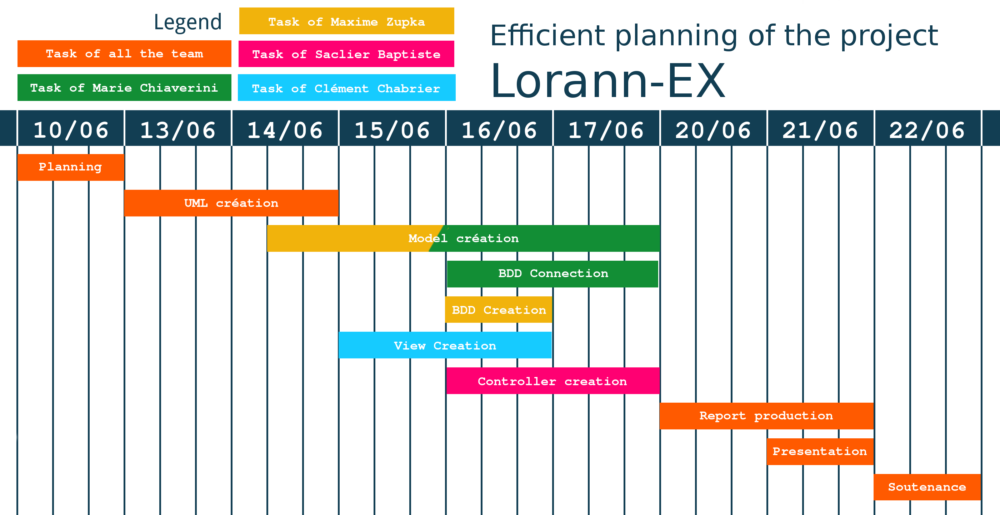

Planning
========

At the beginning of the project we had to organize all the project to
give differents tasks to the members of the team.

Team
----

The team is composed of four persons each have a specific task in the
project.

Baptiste Saclier
:   *Project leader* : In charge of the organisation of the project and
    the controller of the software

Marie Chiaverini
:   In charge of the model of the game

Clément Chabrier
:   In charge of the view of the project

Maxime Zupka
:   In charge of the design of the level, the documentation and the
    administration of the database.

Planning diagram
----------------

### Estimated planning

### Efficient planning

